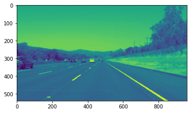
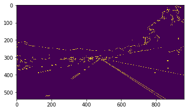
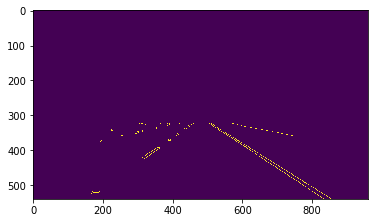
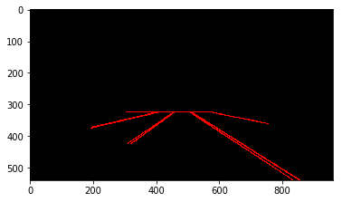
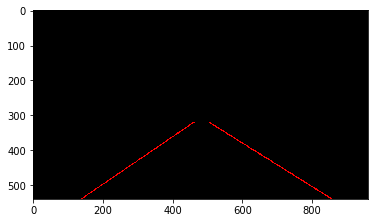

# Self-Driving Car Engineer Nanodegree
## Project: Finding Lane Lines on the Road 

***
The goals / steps of this project are the following:
* Make a pipeline that finds lane lines on the road
* Reflect on your work in a written report

---
Let's have a look at our first image called 'test_images/solidWhiteRight.jpg'.

The tools we have are color selection, region of interest selection, grayscaling, Gaussian smoothing, Canny Edge Detection and Hough Tranform line detection.  The goal is piece together a pipeline to detect the line segments in the image, then average/extrapolate them and draw them onto the image for display (as below).

---

<figure>
 
 <figcaption>
 <p></p> 
 <p style="text-align: center;"> Your output should look something like this (above) after detecting line segments using the helper functions below </p> 
 </figcaption>
</figure>
 <p></p> 
<figure>
 
 <figcaption>
 <p></p> 
 <p style="text-align: center;"> Your goal is to connect/average/extrapolate line segments to get output like this</p> 
 </figcaption>
</figure>

## Initial Setup
Thankfully most of the code and techniques were well described in the lesson. I did not get any problem in detecting the lane lines. Here is the initial code to import libraries and the helper functions.


```python
#importing some useful packages
import matplotlib.pyplot as plt
import matplotlib.image as mpimg
import numpy as np
import cv2
import math
%matplotlib inline

#reading in an image
image = mpimg.imread('test_images/solidWhiteRight.jpg')

#printing out some stats and plotting
print('This image is:', type(image), 'with dimensions:', image.shape)
plt.imshow(image)  # if you wanted to show a single color channel image called 'gray', for example, call as plt.imshow(gray, cmap='gray')
```


## Reflection
### Describe your pipeline. As part of the description, explain how you modified the draw_lines() function.

The lane detection pipeline followed the steps mentioned in the lesson:
* First the image was converted to grayscale. Although by doing so we lost the color information that was very useful from differentiating lane lines from other lines of arbitrary color, it was not a problem for the images/videos of this project. For converting to grayscale I used the exact same function provided in the lesson which uses cv2.cvtColor() function.


* The next step was to apply gaussian smoothing to the image. The code was provided in the lesson. I used a kernel size of 5.





* The I used the canny edge detection algorithm to detect edges. I used a low threshold of 50 and a high threshold of 150. The two values were derived by experimentation with different values.





* The next step was to select a region of interest. I selected a trapezoidal region of interest with fixed vertices. Since the vertices are hardcoded, they will not fit for images/videos other than the ones provided in the project.


```python
vertices = np.array([[[720, 324], [240, 324], [40, 540], [920, 540]]], dtype=np.int32 )
img_region = region_of_interest(edges, vertices)
plt.imshow(img_region)
```




* The fifth step was to run hough trnasform on the edge detected image and draw the lines. First I used the draw_lines() function provided in the notebook. I used the min_line_length of 20 and max_line_gap of 100 to identify large lines.





* The final and the most involved step was to modify the draw_lines function provided in the lesson to interpolate. Here are the steps I followed to interpolate lines to full lane line length.
  1. First I calculated the slope of the line: slope = ((y2 - y1) / (x2 - x1))
  2. Then I calculated the size of the line:
  3. Then I checked if the slope is less than -0.5 its a left line, otherwise a right line.
  4. I iterated through all the detected lines and selected the largest left and right lines as the ones to interpolate.
  5. Last I calculated the slope and intercept of the selected left and right lines and drew lines with the same slope and intercept to the full length of the image.


```python
def draw_lines(img, lines, color=[255, 0, 0], thickness=2):
    """
    NOTE: this is the function you might want to use as a starting point once you want to 
    average/extrapolate the line segments you detect to map out the full
    extent of the lane (going from the result shown in raw-lines-example.mp4
    to that shown in P1_example.mp4).  
    
    Think about things like separating line segments by their 
    slope ((y2-y1)/(x2-x1)) to decide which segments are part of the left
    line vs. the right line.  Then, you can average the position of each of 
    the lines and extrapolate to the top and bottom of the lane.
    
    This function draws `lines` with `color` and `thickness`.    
    Lines are drawn on the image inplace (mutates the image).
    If you want to make the lines semi-transparent, think about combining
    this function with the weighted_img() function below
    """
    bestleftsize = 0
    bestrightsize = 0
    bestleftlane = (0, 0, 0, 0)
    bestrightlane = (0, 0, 0, 0)
    ymin = 320
    ymax = 540
    for line in lines:
        for x1,y1,x2,y2 in line:
            if x1 != x2 and y1 != y2:
                slope = ((y2 - y1) / (x2 - x1))
                size = math.hypot(x2 - x1, y2 - y1)
                if slope < -0.5:
                    if size > bestleftsize:
                        bestleftlane = (x1, y1, x2, y2)
                        bestleftsize = size
                elif slope > 0.5:
                    if size > bestrightsize:
                        bestrightlane = (x1, y1, x2, y2)
                        bestrightsize = size
    if bestleftsize > 0:
        leftslope = ((bestleftlane[3] - bestleftlane[1]) / (bestleftlane[2] - bestleftlane[0]))
        leftintercept = bestleftlane[1] - leftslope * bestleftlane[0]
        leftx1 = int((ymin -leftintercept) / leftslope)
        leftx2 = int((ymax -leftintercept) / leftslope)
        cv2.line(img, (leftx1, ymin), (leftx2, ymax), color, thickness)

    if bestrightsize > 0:
        rightslope = ((bestrightlane[3] - bestrightlane[1]) / (bestrightlane[2] - bestrightlane[0]))
        rightintercept = bestrightlane[1] - rightslope * bestrightlane[0]
        rightx1 = int((ymin -rightintercept) / rightslope)
        rightx2 = int((ymax -rightintercept) / rightslope)
        cv2.line(img, (rightx1, ymin), (rightx2, ymax), color, thickness)

line_image = hough_lines(img_region, rho, theta, threshold,
                            min_line_length, max_line_gap)

plt.imshow(line_image)
```




### Identify potential shortcomings with your current pipeline
My pipeline has following limitations:
* The draw_lines method is a bit shaky and is bound to fail in sudden changes in the direction.
* Since I am converting the image to grayscale, a lot of color information is lost which may be useful in lanes of different color.
* For selecting a trapezoidal regions of interest I am using fixed set of vertices which will not be applicable to any images other than those provided with this project.

###  Suggest possible improvements to your pipeline
The pipeline can be improved in the following ways:
* I would like utilize the color channel of the image as well to identify lane lines.
* Adding contrast to the image will also help to distinguish lane lines.
* The draw_lines function can be further improved: possibly by selecting multiple left and right lines and then averaging their slope.
* The selecting region of interest, we can use the image shape to deduce vertices instead of hard coding them. But I dd not know a generic way to do it.
